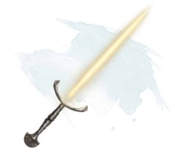

# Barrow of the Two Brothers

## Intro


**Description:**

---

Night falls over the small village of Riverden. Three adventurers meet at The Crowded Twig, the inn close to the river. A simple wooden shack, with a reinforced wooden door, a rustic place, with a few small rooms and no luxuries.

There is a hand full of Riverden residents at the inn, most of them eating and drinking before going home, a few playing cards. 

The innkeeper is a young male dwarf named Edmur.

---

## The Crowded Twig

**Menu:**

* Barley Porridge, Mug of Ale (3 cp)
* Oat Porridge, Mug of Ale (4 cp)
* Vegetable Stew, Mug of Stout (2 cp)
* Stewed Pork and Rye Bread, Tankard of Stout (12 cp)

**Rumors:**

* This land was once ruled by a queen and her two sons. Somewhere in the hills, hidden in a tomb, there are treasures beyond any imagination.
* Some villagers have seen flares of daylight during the night, some say it's the work of witches, others say it's dragons.
* Everybody knows the best way to dispose of skeletons is to punch them in the face.

## Quest

A foolish, young man (**Anders**) went seeking treasure in the local hills. His distraught father (**Eldrik**) has offered 50gp to those who find him.

## Barrow of the Two Brothers

Not far away in the local hills, you find an entrance to what seems to be an ancient tomb.


### Entrance

**Description:**

---

As you descend into the dungeon you walk into a large chamber. There is a chalice in the center of the room and healthy fire burns in it like someone has been there recently.

In the front there is a colossal painting. In it, two knights are fighting each other. The knight on the right is holding a dagger to the side of his opponent while the knight on the left is piercing the other's heart with his sword. Under the painting, there are some dusty fading writings.

There is a dead body, crushed under a slab, in front of a double door. In his hand, there is a book that resembles a grimoire. There is also a bag of dragon scale dust hidden in his garments.

Close to the wall, there are two sarcophagi; one on each side.

---

**Grimoire** 

1. `Identify` 
2. `Arcana check (DC15)` 

**Daylight flame spell**.

---
Spreading a hand full of dragon scale dust in the air and chanting the magical words "Here comes the sun nananana..." while snaping your fingers, a magically imbued ball of fire emerges producing daylight in the darkest of nights. This effect lasts for 5min.

---

**Double door:**

```
It's wooden sturdy double door. 
It's firmly closed. 
```

1. `Open (DC10)` 
2. `Break (DC15)` HP 15

**Paint writtings**: 

1. `History check (DC10)` : 


**Barrow of the Two Brothers**

---

The Queen had two sons. When invasion threatened the kingdom, the eldest son Ethelred led its defense. But the battle went badly, and the Queen was mortally wounded. Ethelred fled, leaving young Olaf to turn the tide of battle. Olaf plotted to usurp the cowardly Ethelred. Ethelred plotted to assassinate the traitorous Olaf.
The brothers fought - Olaf slew his brother with his enchanted sword but succumbed to Ethelred’s poisoned dagger. In her despair, the dying Queen
had the two brothers buried together and their co-conspirators executed.

---

### Ethelred the Coward (left sarcophagus):

```
The sarcophagus has an inscription that reads: "Ethelred the Coward". There is an effigy holding a dagger.
```

If the party hasn't picked the **other weapon**:

```
A strong dark aura emanates from it, a clear indication that it's most likely a magical item.
``` 

**Dagger** 
1. `Identify` 
2. `Arcana check (DC15)`

**Grudge Knife**

 

---
Forged as a tangible symbol of a wrong left unrighted, this short, stocky blade is etched with runes detailing the nature of the grudge. The wielder attunes to the Grudge Knife by making a blood pact. Blood pact has a chance `(DC10)` of causing 2 piercing damage.

Once attuned, on a hit, the target takes an additional 1d4 bludgeoning damage from the force of the knife's rage.

If the target of the grudge and their whole family line dies, the knife reverts to being a non-magical blade. 

---

### Olaf the usurper (right sarcophagus):

**Pressure trap** close to the sarcophagus. A slab falls from the ceiling for 2 bludgeoning damage.

1. `Perception check (DC5)`
2. `Dexterity save (DC10)` to avoid damage.

```
The sarcophagus has an inscription that reads: "Ethelred the Coward". 
There is an effigy holding a long sword.
```

If the party hasn't picked the **other weapon**:

```
A warm faible aura emanates from it, a clear indication that it's most likely a magical item.
``` 

**Long sword** 
1. `Identify` 
2. `Arcana check (DC15)`

**Sun Blade**



---
This item appears to be a longsword hilt. While grasping the hilt, a blade of pure radiance springs into existence. While the blade exists, this magic longsword has the finesse property. If you are proficient with shortswords or longswords, you are proficient with the sun blade.

The sword’s luminous blade emits sunlight in a 15 foot radius. This weapon deals radiant damage instead of slashing damage.

The sword has lost most of his magical power, it can only be used during 3 combat rounds.

---

As soon as a PC pick one of the weapons the other looses it's magical powers.

## Tomb of the traitors

---
You find you self in large dark hall [Dim light](). In the center of the hall there are 3 large columns to each side. There are also 4 sarchopagi to each side, close to the walls.

---

As players progress into the room:

---
At the end of the large hall there is a second double door. Standing next to it there are 2 skeletons. Each wears a silver torc inscribed with ‘Traitor’ (10gp each). There is a writing along the arc of the door.

The writting on the door reads:

For I'm a thing you cannot choose,
You're stuck with what you've got,
But I'm a thing that one can lose,
For granted, take me not.

---
1. `Riddle`: **family** or **brothers**
2. `Combat`: 2 [skeletons](https://www.dndbeyond.com/monsters/17015-skeleton) 


## The Two brothers

---

As you walk into the room you seee Ethelred and Olaf’s skeletons sitting on opposing thrones; a gold crown (300gp) rests between them. 

There are also 2 [skeletons](https://www.dndbeyond.com/monsters/17015-skeleton) guards awaiting orders. The spirits of the two brothers appear.

---
Ethelred’s spirit imperiously declares, 

```
Crown my remains and allow my spirit to rest. 
As the eldest, the crown is rightfully mine.
```

Olaf demands:

```
Crown me, I saved the kingdom from my brother’s cowardice.
```

* If the PCs crown a brother his spirit will fade.
Enraged, the other brother will attack as a [Shadow](https://www.dndbeyond.com/monsters/17010-shadow) and order the skeletons to attack.
* If the PCs crown neither, or try to steal the
crown, then both brothers attack as Shadows.

